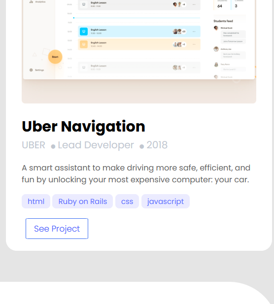

# Portfolio portfolio

The project is inspired by the figma microverse template 1 (https://figma.com/)
The goal of this project is to learn how parse a Figma design to create a UI, and use Flexbox to place elements in the page.

- Screenshoot I

- Screenshoot II

- Screenshoot III

- set up a new repository and prepare it for development using best practices.
- build mobile website.
 

## Live Demo

[Live Demo Link](https://portfoliocodecaiine.github.io/)
 
## Built With

- HTML
- CSS
- HTML&CSS Linter

## Get Started

Please get your browser update.
To get a local copy up and running follow these simple steps.

Run the command below from the Terminal:

      git clone <URL> in your terminal

	  cd microverse_portfolio

	  start index.html

## Authors

👤 **Yannick-Noel AKA**

- Location: Côte d'Ivoire
- GitHub: [@codecaiine](https://github.com/codecaiine)
- Twitter: [@yannicknaka](https://twitter.com/yannicknaka)
- LinkedIn: [LinkedIn](https://www.linkedin.com/in/yannick-no%C3%ABl-aka/)

## 🤝 Contributing

Contributions, issues, and feature requests are welcome!

Feel free to check the [issues page](../../issues/).

## Show your support

Give a ⭐️ if you like this project!

## Acknowledgments

- Thanks to Microverse to made it
- My learning and coding partners

## 📝 License

This project is [MIT](./MIT.md) licensed.
